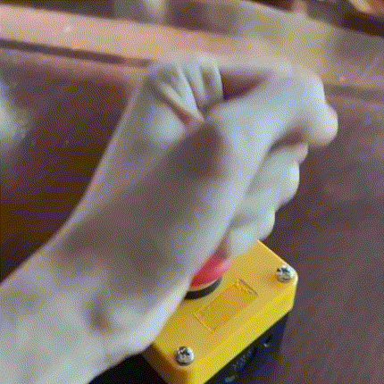

# Magic_Button
Inspired from a cartoon with a "press it when you miss me button". I created this project to realize it.

## Technical details
The project is built around ESP32-C3 using ESP-IDF framework. By utilizing the deep sleep mode of ESP32-C3 we can achieve very good battery life. 

### How it works
1. The first time it boots the devices will generate a QR code on the serial console which can be scan by user to start wifi provisioning process.
2. Once the wifi is connected the devices will send a message through webhook.
3. A GPIO pin which the physical button is connected will be set as the weakup pin. In my case it is GPIO16.
4. The device goes to deep sleep mode. 
5. Once the button is pressed the device weaks up and execute from step 2.

### Hardware list
All components are off-the-shelf and you can change them to fit your needs.
- [Push button box](https://a.co/d/1qGmXbh)
- [Momentary Push button](https://a.co/d/cj4iO43)
**Not a Latching push button**
- [ESP32-C3 devboard](http://www.lilygo.cn/prod_view.aspx?TypeId=50063&Id=1361&FId=t3:50063:3)
- Any Li-ion battey 

## To build
- Change the webhook url and your payload(message) in `src/main.c`
- Install PlatformIO
- Clone this repo. Add it as a PlatformIO project. 
- Connect the board to your computer through a usb cable
- Build, Flash and Monitor using PlatformIO.

